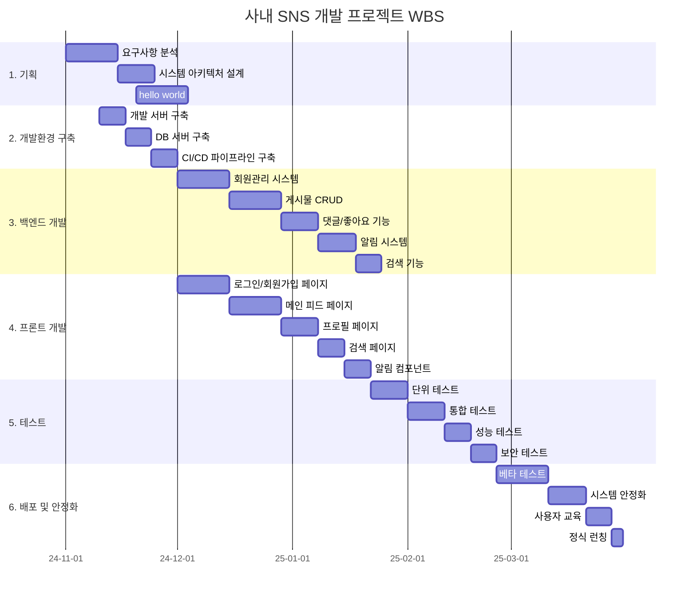

# 1. 블록

페이지는 블록으로 되어 있습니다. 이 블록은 마치 레고 블록처럼 자유롭게 조립할 수 있습니다. 이 블록 왼쪽 끝에 마우스를 오버하면 점 6개가 나오는데 이를 통해 위치를 조정하거나 색을 바꿀 수 있습니다.

색을 바꿔보고, 전환해보고, 위치도 옮겨보세요.

# 2. 블록 생성

이번에는 블록을 생성해보도록 하겠습니다. 블록을 생성하는 방법은 크게 3가지가 있습니다. 마우스 커서로 빈 공간을 클릭하는 방법, 엔터를 치는 방법, 슬러시를 이용한 방법입니다. 이 3가지 중 앞 2가지는 텍스트 블록만을 생성합니다. 슬러시를 이용하면 다양한 블록을 생성할 수 있습니다.

# 3. 블록 종류

`/`를 입력하면 블록의 종류를 볼 수 있습니다. 종류는 아래와 같습니다. 상세한 내용은 2.3절에서 다루겠습니다.

- 기본 블록
- AI 블록
- 미디어 블록
- 데이터 베이스 블록
- 고급 블록
- 인라인 블록
- 임베드 블록
- 동기화된 데이터베이스
- 가져오기

# 4. 노션 블록이 강력한 이유

아래와 같은 다이어그램이나 차트를 깔끔하게, 편리하게 그릴 수 있기 때문입니다. 이는 단순 문서의 영역을 넘어선 것이죠.

