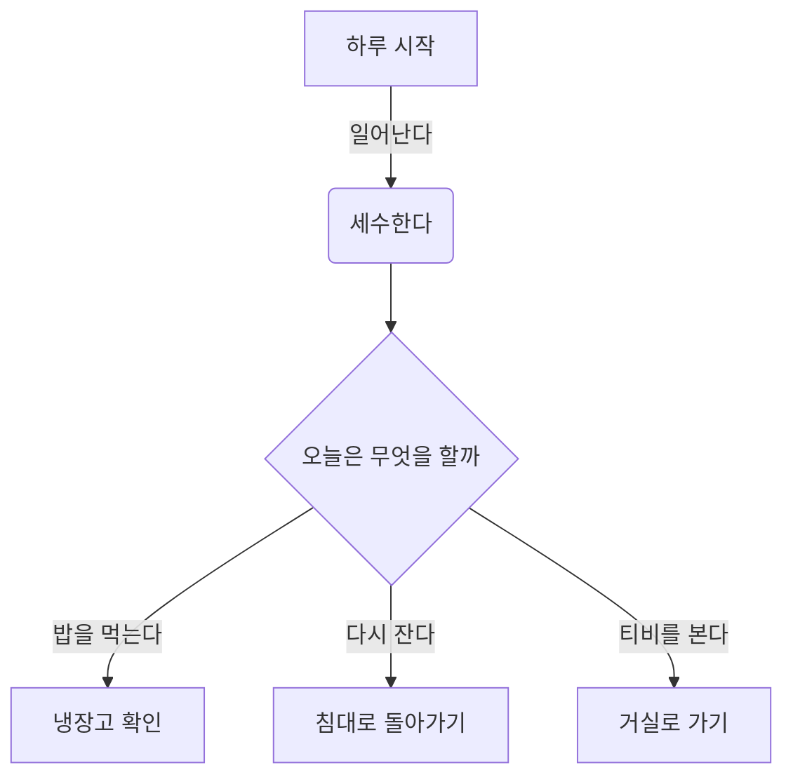
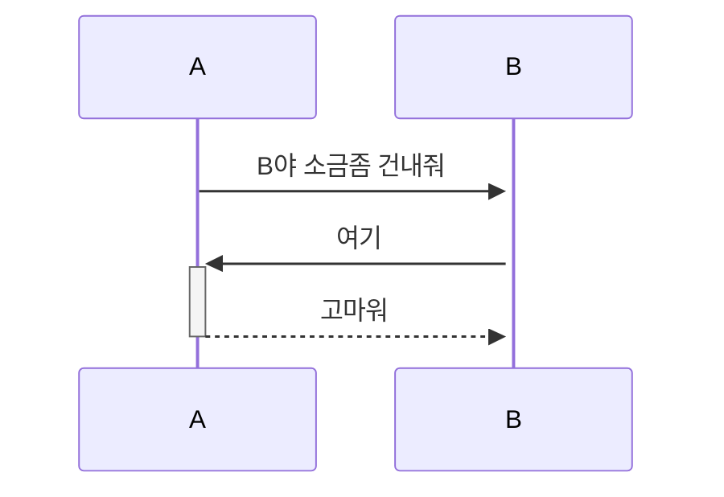
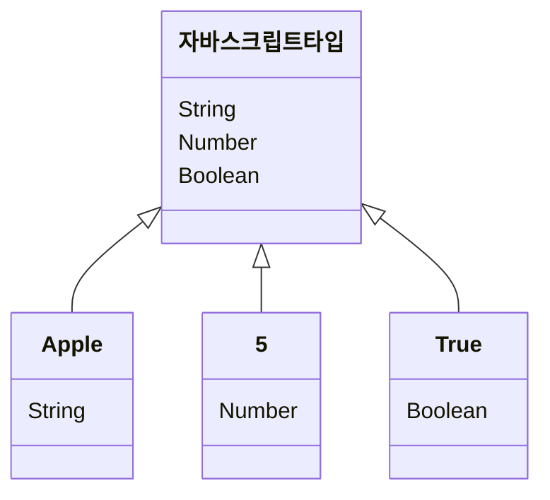
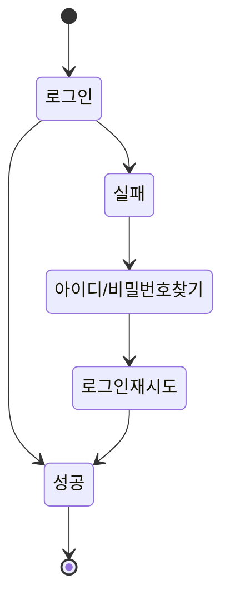
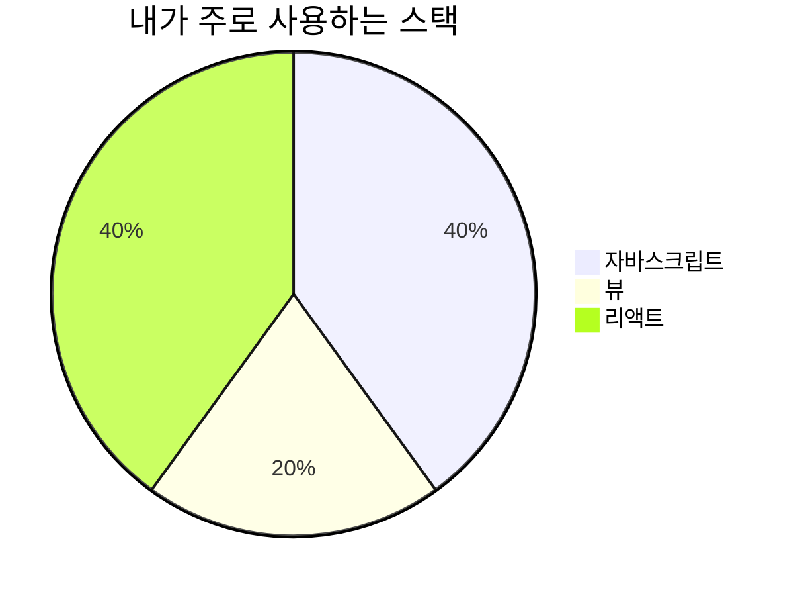
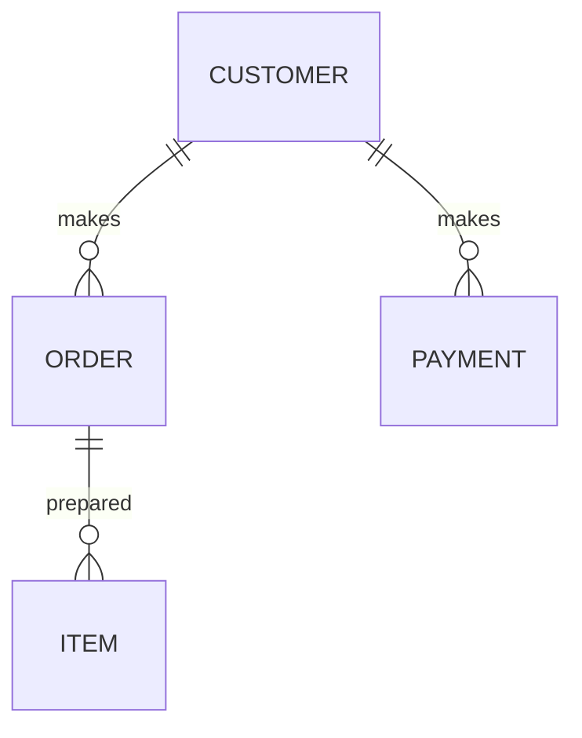
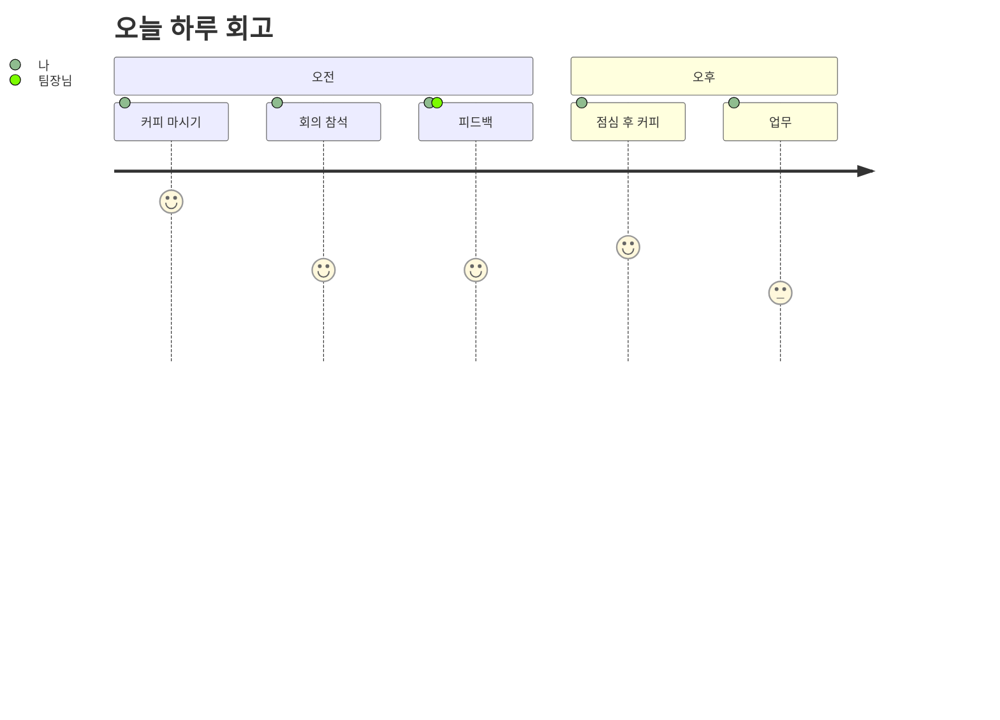
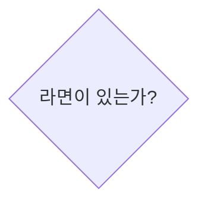

# Mermaid로 GitHub 내에서 순서도 그리기

](/images/github/chapter03-4/01_%E1%84%86%E1%85%A5%E1%84%86%E1%85%A6%E1%84%8B%E1%85%B5%E1%84%83%E1%85%B3.png)

[Mermaid-js.github.io](http://Mermaid-js.github.io)

## 1. 머메이드**란?**

이전엔 표, 차트, 다이어그램등을 그릴 때  유료 도구인 [Visio](https://www.microsoft.com/ko-kr/microsoft-365/visio/flowchart-software)나  파워포인트로 직접 그려 이미지를 추가했다면, 최근 깃에서 지원하는 머메이드라는 도구를 활용해 차트를 더욱 쉽고 빠르게 코드로 작성할 수 있게 되었습니다. 

머메이드는 텍스트와 코드를 통해 **다이어그램 또는 차트와 같이 데이터를 시각화** 할 수 있도록 도와주는, **자바스크립트 기반의 도구**입니다. 서비스 개발 시 필요한 데이터, 서비스의 구조나 흐름을 작성할때 사용할 수 있습니다.  

머메이드는 고유의 문법을 사용하는 데요, 마크다운을 이미 알고 있다면, 그리고 [**공식 가이드**](https://mermaid-js.github.io/mermaid/#/)를 참고 한다면 금방 배울 수 있습니다.  

아래 서비스에서 라이브로 코드를 확인할 수 있습니다.

[Online FlowChart & Diagrams Editor - Mermaid Live Editor](https://mermaid.live/)

## 2. 머메이드로 그릴 수 있는 것들

머메이드가 지원하는 차트와 다이어그램의 예시를 살펴 보겠습니다. 코드에 대해서는 뒤에서 상세히 살펴보도록 하겠습니다.

- **플로우 차트 (Flow  Chart)**
    
    특정 대상의 행동의 흐름을 기록하기 좋습니다. 
    


```markdown


```

- **시퀀스 다이어그램 (Sequence Diagram)**
    
    유저간의 대화 내용이나 데이터 요청 및 전송 등 시간의 흐름을 나타낼때 사용하면 좋습니다. 
    


**graph** TD

A[하루 시작] **-->**|일어난다| B(세수한다)

B **-->** C{오늘은 무엇을 할까}

C **-->**|밥을 먹는다| D[냉장고 확인]

C **-->**|다시 잔다| E[침대로 돌아가기]

C **-->**|티비를 본다| F[거실로 가기]

```markdown


```

- **클래스 다이어그램 (Class Diagram)**
    
    여러가지 주제를 그룹짓거나 나눌 때 사용할 수 있습니다. 
    


```markdown


```

- **상태 다이어그램 (State Diagram)**
    
    행동에 따른 상태를 기록하기 좋습니다. 
    


```markdown


```

- **간트 차트 (Gantt Chart)**
    
    프로젝트 관련 일정을 정리하기 좋은 차트입니다. 
    
    
    

```markdown

```mermaid
		gantt
	    title 하루 일과
	    dateFormat  HH-MM
	    axisFormat %H:%M
	    하루시작 : milestone, m1, 17:49,2min
	    할일1 : 60min
	    할일2 : 30min
```
```

- **파이 차트 (Pie Chart)**
    
    특정 주제 및 데이터이 점유율이나 수치를 기록할 때 사용할 수 있습니다. 
    


```markdown


```

- **ER 다이어그램 (ER Diagram)**
    
    개체와 개체간의 관계를 표현할때 사용 할 수 있습니다. 해당 다이어그램은 한글 지원이 되지 않습니다. 
    


```markdown


```

- **고객 여정 다이어그램 (User Journey)**
    
    특정 서비스를 사용하는 유저의 행동을 세부적으로 기록할 때  사용할 수 있습니다.  
    
    
    

```markdown


```

위의 다이어그램과 차트는 [**머메이드 라이브 에디터**](https://mermaid-js.github.io/mermaid-live-editor/edit#pako:eNpVj81qw0AMhF9F6JRA_AI-FBI7OQVSSOjF64Pwyt0l3h8WmVBsv3s3NYFUJ2m-GRhN2AXNWOJ3omjgVisPefbNvoWi-Ji_ZjhsrgNz3K7k8JShms4s4BjEWH9fVlT9JS6eZ6ibM0UJsX0nt0eY4djYTxM8_ycmcU6dmp7KnoqOElSUWtyh4-TI6lxwegYUimHHCsu8au5pHESh8ku2jlGT8FFbCQlLSSPvkEYJ1x_fve7VU1vK77pVXH4B3FJSeQ)에서 직접 테스트 해 볼 수 있습니다. 

## 3. 머메이드로 플로우차트 만들어 보기

머메이드는 마크다운에 직접 사용할 수 있습니다. 먼저 머메이드 테스트를 위한 레파지토리를 생성한 후, 리드미 마크다운 파일에 직접 사용해보겠습니다. 

1. 먼저 마크다운 파일에 머메이드를 사용할 것임을 명시합니다. 다이어그램이나 차트가 들어갈 곳에 적어주면 좋습니다. 

```markdown

#라면 끓이는 방법! 

```mermaid

```
```

1. 위 차트의 종류 중, 사용할 차트의 이름을 적어줍니다. 
    - `flowchart`
    - `sequenceDiagram`
    - `classDiagram`
    - `stateDiagram`
    - `erDiagram`
    - `journey`
    - `gantt`
    - `pie`
    - `requirementDiagram`
    

다이어그램 및 차트 별 사용방법은 위에서 언급한 라이브 에디터와 [**공식 홈페이지**](https://mermaid-js.github.io/mermaid/#/flowchart)를 통해 참고할 수 있습니다. 우리는 `flowchart`를 활용하여 라면을 끓이는 간단한 플로우차트를 만들어 보겠습니다.  

```markdown

#라면 끓이는 방법!   

```mermaid
	flowchart 
```
```

1. `flowchart`를 사용할 것임을 적어준 후, 플로우차트의 방향을 지정해 줍니다. 
- `TB`  위 → 아래
- `TD`  위 → 아래 (`TB`와 동일)
- `BT`  아래 → 위
- `RL`  오른쪽 → 왼쪽
- `LR`  왼쪽 → 오른쪽

```markdown

#라면 끓이는 방법!   

```mermaid
	flowchart LR
```
```

1. 노드는 `flowchart LR` 아래 노드의 이름을 영문으로 적고, 원하는 텍스트를 [ ] 사이에 추가해 줍니다.  
예시의 경우,  `A[냄비를 꺼낸다]` 라고 적어주었습니다. 아래와 같이 마름모 모양의 첫 텍스트 노드가 생성됩니다. 


```markdown

#라면 끓이는 방법!  


```

**노드의 모양**은 아래와 같이 변경이 가능합니다. 

- `(텍스트)`: 둥근모서리 박스
- `([텍스트])` : 스타디움, 알약 모양
- `[[텍스트]]` : 각진 모양
- `[(텍스트)]` : 실린더 모양
- `((텍스트))` : 원
- `>텍스트]`  : 비대칭
- `{텍스트}` : 마름모
- `{{텍스트}}` : 육각형
- `[/텍스트/]` , `[\텍스트\]` : 평행사변형
- `[/텍스트\]` , `[\텍스트/]` : 사다리꼴

1. 다양한 선택지가 있다면 아래와 같이 선으로 연결 후 `|텍스트|` 안에 적어줍니다. 
이후 다음 노드인 `B` 의 내용을 작성합니다.  
    
    
    
    
    ```markdown
    
    #라면 끓이는 방법!  
    
    ```mermaid
    	flowchart LR
    		A{라면이 있는가?} -->|있다| B(냄비를 준비한다)
    		
    ```
    ```
    

노드간 **다양한 스타일의 선**으로 연결이 가능합니다. 기본 스타일 몇가지를 살펴보겠습니다.  ****

- `-->` 화살표
- `---` 실선
- `-.->` 점선 화살표
- `==>` 굵은 화살표

1. 이후 다음과 같이 노드간 연결해 줍니다. `A` 에서 `B` 로, `B`에서 `C` 로 선을 연결하며 작성합니다. 
    
    
    
    
    ```markdown
    
    #라면 끓이는 방법!  
    
    ```mermaid
    	flowchart LR
    		A{라면이 있는가?} -->|있다| B(냄비를 준비한다)
    			B -->C(머그컵 2잔 분량의 물을 붓는다)
    			C -->E(스토브를 키고 물을 끓인다)
    			E -->F(적당히 끓으면 스프를 넣는다)
    			F -->G(물이 완전히 끓으면 면과 파를 넣는다)
    			G -->H((쫄깃한 면을 원하는가?))
    ```
    ```
    

1. 동일한 노드를 가리키면 아래와 같이 자동 연결해 줍니다.  `I` 의 경우, 내용을 작성했다면 아래에서 중복 작성하지 않아도 됩니다. 
    
    
    
    
    ```markdown
    
    #라면 끓이는 방법!  
    
    ```mermaid
    	flowchart LR
    		A{라면이 있는가?} -->|있다| B(냄비를 준비한다)
    			B -->C(머그컵 2잔 분량의 물을 붓는다)
    			C -->E(스토브를 키고 물을 끓인다)
    			E -->F(적당히 끓으면 스프를 넣는다)
    			F -->G(물이 완전히 끓으면 면과 파를 넣는다)
    			G -->H((쫄깃한 면을 원하는가?))
    					H -->|원한다| H1(면을 넣었다 뺐다를 반복한다)
            	H -->|원치 않는다| H2(그냥둔다)
            	H1 --> I(보기 좋게 그릇에 담는다)
            	H2 --> I
    			I --> J(맛있게 먹는다)
    ```
    ```
    

1. 아래와 같이 플로우차트를 완성해보았습니다. 
    
    
    
    
    ```markdown
    
    #라면 끓이는 방법!  
    
    ```mermaid
    	flowchart LR
    		A{라면이 있는가?} -->|있다| B(냄비를 준비한다)
    			B -->C(머그컵 2잔 분량의 물을 붓는다)
    			C -->E(스토브를 키고 물을 끓인다)
    			E -->F(적당히 끓으면 스프를 넣는다)
    			F -->G(물이 완전히 끓으면 면과 파를 넣는다)
    			G -->H((쫄깃한 면을 원하는가?))
    	        	H -->|원한다| H1(면을 넣었다 뺐다를 반복한다)
    	        	H -->|원치 않는다| H2(그냥둔다)
    	        	H1 --> I(보기 좋게 그릇에 담는다)
    	        	H2 --> I
    	        	I --> J(맛있게 먹는다)
    	   A -->|없다| K(라면을 사러간다)
    	    		K --> L(원하는 라면을 고른다)
    	    		L --> M(산다)
    	    		M --> N(집에간다)
    	    		N --> A
    ```
    ```
